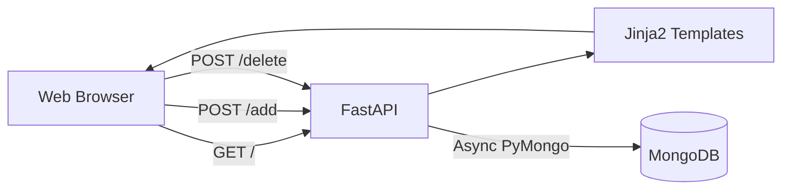
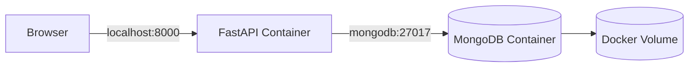
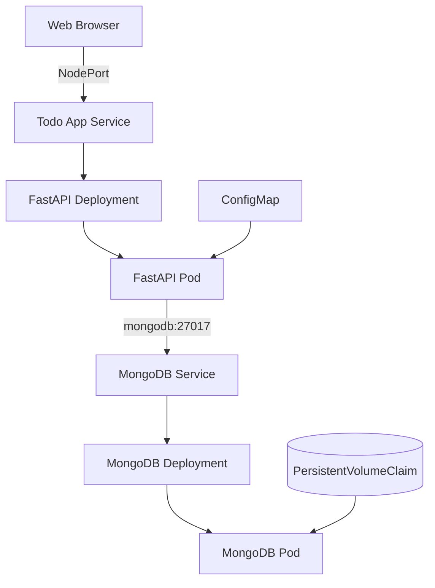
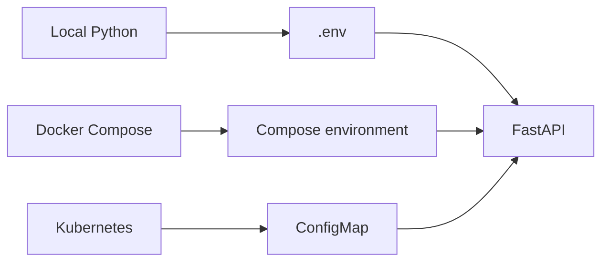
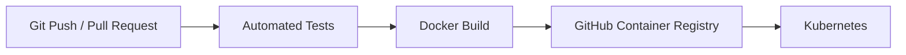

# TODO DevOps Project

A hands-on DevOps project built around a simple Python Todo web application.

The application is intentionally small so the main focus can stay on the full delivery lifecycle: **application development, persistent storage, containerization, orchestration, infrastructure configuration and CI/CD**.

## Recruiter Snapshot

This project currently demonstrates practical experience with:

- Python and FastAPI backend development
- asynchronous MongoDB integration with PyMongo
- Jinja2 server-side rendering and HTML forms
- Docker image creation with a custom Dockerfile
- multi-container environments with Docker Compose
- Docker networking, environment variables and persistent volumes
- Kubernetes Deployments and Services
- Kubernetes PersistentVolumeClaims
- Kubernetes ConfigMaps
- local Kubernetes deployment with Minikube
- Git-based incremental development

Still being added:

- GitHub Actions CI/CD
- GitHub Container Registry
- Terraform Infrastructure as Code
- extended automated testing

---

## Current Status

| Technology | Purpose | Status |
|---|---|---|
| Python | Application backend | ✅ Implemented |
| FastAPI | Web framework | ✅ Implemented |
| Jinja2 | Server-side HTML rendering | ✅ Implemented |
| MongoDB | Persistent Todo storage | ✅ Implemented |
| PyMongo Async | Asynchronous database access | ✅ Implemented |
| Docker | Application containerization | ✅ Implemented |
| Docker Compose | Local multi-container stack | ✅ Implemented |
| Kubernetes | Container orchestration | ✅ Implemented |
| Minikube | Local Kubernetes cluster | ✅ Implemented |
| PersistentVolumeClaim | MongoDB persistence in Kubernetes | ✅ Implemented |
| ConfigMap | Application configuration | ✅ Implemented |
| pytest | Test scaffolding | 🔄 In progress |
| GitHub Actions | CI/CD automation | ⏳ Next stage |
| GHCR | Container image registry | ⏳ Planned |
| Terraform | Infrastructure as Code | ⏳ Planned |

---

## Application Features

The current application supports:

- [x] displaying Todo items
- [x] adding Todo items
- [x] deleting Todo items
- [x] persistent storage in MongoDB
- [x] asynchronous database operations
- [x] server-side HTML rendering with Jinja2
- [x] configuration through environment variables

A Todo document is stored in MongoDB approximately as:

```python
{
    "_id": ObjectId(...),
    "title": "Learn Kubernetes"
}
```

---

## Current Application Architecture



The application no longer uses temporary in-memory Todo storage. Todo data is persisted in MongoDB.

---

## Docker

The application has been containerized using a custom `Dockerfile` based on a slim Python image.

Implemented Docker concepts:

- [x] Dockerfile creation
- [x] Python dependency installation inside the image
- [x] Uvicorn startup command
- [x] port exposure
- [x] Docker image build
- [x] running FastAPI inside a container
- [x] container networking
- [x] environment-based MongoDB configuration

### Docker Compose

A Docker Compose stack is used to run FastAPI and MongoDB together.



The Compose setup provides:

- FastAPI application container
- MongoDB 8 container
- automatic internal Docker networking
- persistent MongoDB volume
- application environment variables
- dependency ordering between services

The complete local stack can be started with:

```bash
docker compose up --build
```

---

## Kubernetes / Minikube

The Dockerized application has also been deployed to a local Kubernetes cluster using Minikube.

Implemented Kubernetes resources and concepts:

- [x] FastAPI Deployment
- [x] FastAPI Service
- [x] MongoDB Deployment
- [x] MongoDB ClusterIP Service
- [x] MongoDB PersistentVolumeClaim
- [x] ConfigMap for application configuration
- [x] NodePort access to the application
- [x] local Docker image loading into Minikube
- [x] Pod and Service verification with `kubectl`
- [x] end-to-end communication between FastAPI and MongoDB inside the cluster

### Current Kubernetes Architecture



This stage demonstrates the transition from a local Docker Compose environment to container orchestration with Kubernetes.

---

## Configuration Flow

The application reads MongoDB configuration from environment variables:

```text
MONGODB_URI
MONGODB_DB
```

The source of those values depends on the environment:



This keeps application code independent from the environment where it is running.

---

## Repository Structure

```text
Todo_DevOps_project/
│
├── app/
│   ├── database.py
│   ├── main.py
│   ├── models.py
│   ├── static/
│   └── templates/
│       └── index.html
│
├── tests/
│   ├── test_app.py
│   └── test_db.py
│
├── k8s/
│   └── Kubernetes manifests
│
├── terraform/
│
├── .github/
│   └── workflows/
│
├── Dockerfile
├── docker-compose.yml
├── requirements.txt
└── README.md
```

---

## Development Progress

### Application

- [x] FastAPI application
- [x] Jinja2 integration
- [x] Todo creation
- [x] Todo deletion
- [x] MongoDB ObjectId handling
- [x] persistent Todo storage
- [x] asynchronous MongoDB access
- [ ] Todo editing
- [ ] stronger input validation

### Database

- [x] MongoDB integration
- [x] database configuration through environment variables
- [x] asynchronous connection with PyMongo
- [x] persistent Docker storage
- [x] persistent Kubernetes storage with PVC

### Docker

- [x] Dockerfile
- [x] Docker image build
- [x] application container
- [x] MongoDB container
- [x] Docker networking
- [x] Docker Compose
- [x] persistent named volume
- [x] environment configuration

### Kubernetes

- [x] MongoDB PersistentVolumeClaim
- [x] MongoDB Deployment
- [x] MongoDB Service
- [x] FastAPI Deployment
- [x] FastAPI Service
- [x] ConfigMap
- [x] Minikube deployment
- [x] application exposed through NodePort
- [x] end-to-end application test in Kubernetes
- [ ] Secrets
- [ ] readiness and liveness probes
- [ ] resource requests and limits
- [ ] scaling tests
- [ ] rolling update tests

### Testing

- [x] pytest test structure created
- [x] basic application endpoint test
- [x] separate test environment configuration
- [ ] refine asynchronous MongoDB integration tests
- [ ] integrate tests into CI

### GitHub Actions / CI-CD

Next development stage:

- [ ] create CI workflow
- [ ] install Python dependencies automatically
- [ ] run automated tests
- [ ] validate/build Docker image
- [ ] tag container images
- [ ] push images to GHCR
- [ ] add deployment automation

Target pipeline:



### Terraform

Planned after the CI/CD foundation:

- [ ] configure Terraform provider
- [ ] define infrastructure declaratively
- [ ] add variables and outputs
- [ ] use Terraform state
- [ ] run `terraform init`, `plan` and `apply`
- [ ] integrate Terraform validation with CI

---

## Local Development

Create and activate a virtual environment:

```bash
python -m venv .venv
source .venv/bin/activate
```

Install dependencies:

```bash
pip install -r requirements.txt
```

Run FastAPI locally:

```bash
python -m uvicorn app.main:app --reload
```

Open:

```text
http://127.0.0.1:8000
```

---

## Running with Docker Compose

```bash
docker compose up --build
```

Application:

```text
http://localhost:8000
```

---

## Running with Minikube

After applying the Kubernetes manifests and loading the local application image into Minikube:

```bash
kubectl get pods
kubectl get svc
minikube service todo-app --url
```

The Kubernetes deployment currently provides persistent MongoDB storage and application configuration through a ConfigMap.

---

## Next Stage

The next milestone is **GitHub Actions CI/CD**.

The planned first workflow will run on pushes and pull requests to `main` and will progressively add:

```text
Git Push / Pull Request
        ↓
GitHub Actions
        ↓
Dependency installation
        ↓
Tests
        ↓
Docker image validation/build
        ↓
GHCR
        ↓
Kubernetes deployment
```

---

## Project Objective

The Todo application is deliberately simple. Its purpose is to provide a real workload for learning and demonstrating the complete DevOps lifecycle.

The project currently covers the path from application code to a persistent, containerized and Kubernetes-orchestrated deployment:

**Python · FastAPI · MongoDB · Docker · Docker Compose · Kubernetes · Minikube · ConfigMap · PersistentVolumeClaim**

The next stages extend that lifecycle with:

**GitHub Actions · GHCR · Terraform · CI/CD automation**
