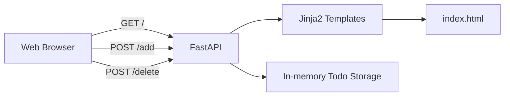
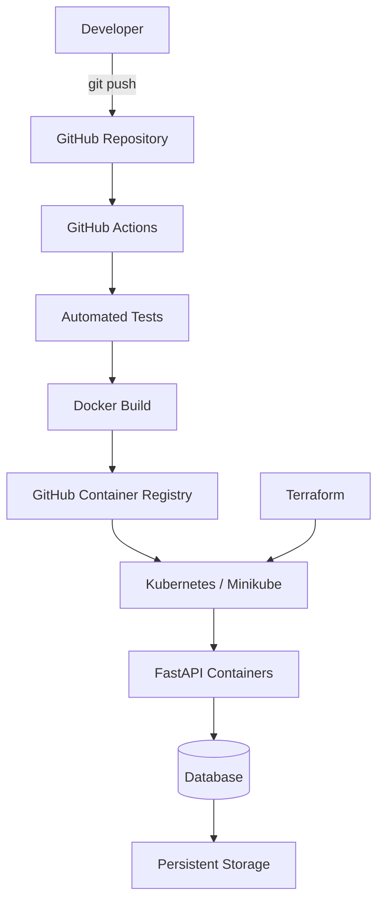
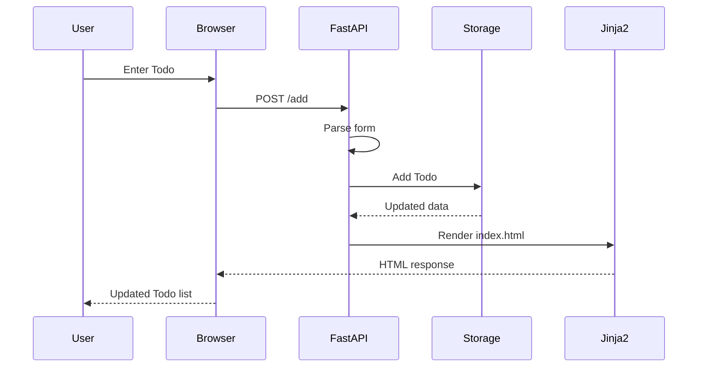
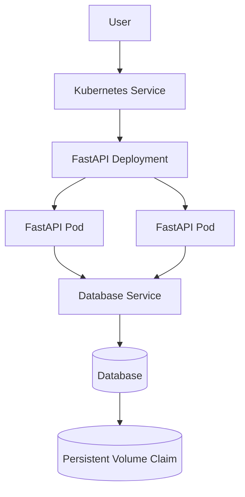
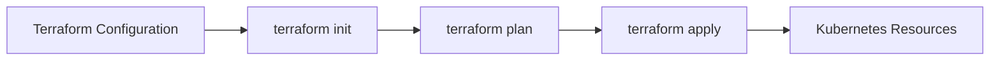
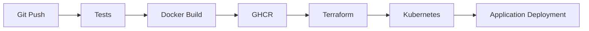

# TODO DevOps Project

A hands-on DevOps project built around a simple Python Todo web application.

The application itself is intentionally minimal. The main purpose of the project is to demonstrate the process of taking an application from source code through **containerization, infrastructure provisioning, Kubernetes deployment and CI/CD automation**.

## Recruiter Snapshot

This project demonstrates practical experience with:

* Python and FastAPI backend development
* HTTP GET/POST request handling
* HTML forms and server-side rendering with Jinja2
* basic application data modelling
* Git-based development workflow
* project dependency management with Python virtual environments
* Docker containerization
* Kubernetes and Minikube
* Infrastructure as Code with Terraform
* CI/CD automation with GitHub Actions

The project is developed incrementally so that every infrastructure component is configured and understood separately.

---

## What Has Been Implemented

### Python / FastAPI

* [x] Created a FastAPI web application from scratch
* [x] Implemented application routing
* [x] Implemented `GET /`
* [x] Implemented `POST /add`
* [x] Implemented `POST /delete`
* [x] Added asynchronous request handling
* [x] Implemented HTML form processing
* [x] Added reusable template rendering logic
* [x] Added unique IDs for Todo objects
* [x] Implemented Todo creation and deletion logic

Todo objects currently use the following structure:

```python
{
    "id": 1,
    "title": "Learn Kubernetes"
}
```

---

### Frontend / Templates

* [x] Created a minimal HTML interface
* [x] Integrated Jinja2 with FastAPI
* [x] Dynamically rendered Todo items
* [x] Implemented HTML forms for adding tasks
* [x] Implemented task deletion using hidden form values
* [x] Connected frontend forms with FastAPI endpoints

---

### Python Environment & Dependencies

* [x] Created isolated Python virtual environment
* [x] Managed application dependencies with `pip`
* [x] Created `requirements.txt`
* [x] Configured Uvicorn development server
* [x] Debugged Python environment and dependency issues

---

## DevOps Stack

| Technology     | Purpose                      | Status        |
| -------------- | ---------------------------- | ------------- |
| Python         | Application backend          | ✅ Implemented |
| FastAPI        | Web framework / API          | ✅ Implemented |
| Jinja2         | Server-side HTML rendering   | ✅ Implemented |
| Git / GitHub   | Source control               | ✅ In use      |
| Database       | Persistent Todo storage      | 🔄 Next stage |
| Docker         | Application containerization | ⏳ Planned     |
| Kubernetes     | Container orchestration      | ⏳ Planned     |
| Minikube       | Local Kubernetes cluster     | ⏳ Planned     |
| Terraform      | Infrastructure as Code       | ⏳ Planned     |
| GitHub Actions | CI/CD automation             | ⏳ Planned     |
| GHCR           | Docker image registry        | ⏳ Planned     |

---

## Current Application Architecture



Currently, Todo objects are stored in application memory.

This is intentionally temporary and will be replaced with persistent database storage.

---

## Target DevOps Architecture



The final workflow will follow:

```text
Code
  ↓
GitHub
  ↓
GitHub Actions
  ↓
Tests
  ↓
Docker Build
  ↓
Container Registry
  ↓
Terraform
  ↓
Kubernetes
  ↓
Running Application
```

---

# Skills Demonstrated

## Python

The application demonstrates practical knowledge of:

* functions
* dictionaries and lists
* loops and conditions
* global application state
* asynchronous functions
* Python type annotations
* dependency management
* virtual environments

---

## FastAPI

Implemented concepts include:

* FastAPI application initialization
* endpoint routing
* GET and POST requests
* `Request` objects
* asynchronous request processing
* form parsing
* template responses
* separation of reusable application logic

Example request flow:



---

## Docker

The containerization stage will demonstrate:

* writing Dockerfiles
* Docker image creation
* application containerization
* dependency installation inside containers
* environment variables
* container networking
* container image versioning

Planned workflow:

```text
Application
     ↓
Dockerfile
     ↓
docker build
     ↓
Docker Image
     ↓
Container
```

---

## Kubernetes

The Kubernetes stage will demonstrate:

* Pods
* Deployments
* ReplicaSets
* Services
* ConfigMaps
* Secrets
* PersistentVolumeClaims
* scaling
* rolling updates
* container orchestration
* local clusters with Minikube

Target Kubernetes architecture:



---

## Terraform

Terraform will be used to manage infrastructure declaratively.

The project will demonstrate:

* Infrastructure as Code
* Terraform providers
* resources
* variables
* outputs
* Terraform state
* `terraform init`
* `terraform plan`
* `terraform apply`
* infrastructure lifecycle management



---

## GitHub Actions / CI-CD

The final CI/CD pipeline will automate the application delivery process.

It will demonstrate:

* workflow YAML configuration
* automated testing
* Docker image building
* Docker image tagging
* authentication with container registries
* pushing images to GitHub Container Registry
* Terraform validation
* deployment automation
* GitHub Secrets management

Target pipeline:



---

# Repository Structure

```text
TODO_DEVOPS_PROJECT/
│
├── app/
│   ├── main.py
│   │
│   └── templates/
│       └── index.html
│
├── tests/
│
├── k8s/
│
├── terraform/
│
├── .github/
│   └── workflows/
│
├── Dockerfile
├── requirements.txt
└── README.md
```

---

# Project Roadmap

### Application

* [x] FastAPI application
* [x] Jinja2 integration
* [x] Todo creation
* [x] Todo deletion
* [x] Todo IDs
* [x] dynamic Todo rendering
* [ ] Todo editing
* [ ] input validation

### Database

* [ ] Add persistent database
* [ ] Create Todo model
* [ ] Move storage logic outside `main.py`
* [ ] Replace in-memory Todo list

### Docker

* [ ] Create Dockerfile
* [ ] Build Docker image
* [ ] Run application in container
* [ ] Configure application environment
* [ ] Add database container

### Kubernetes

* [ ] Create Deployment
* [ ] Create Service
* [ ] Configure application replicas
* [ ] Add ConfigMap
* [ ] Add Secrets
* [ ] Add persistent database storage
* [ ] Deploy using Minikube
* [ ] Test scaling
* [ ] Test rolling updates

### Terraform

* [ ] Configure provider
* [ ] Define infrastructure
* [ ] Create variables
* [ ] Create outputs
* [ ] Manage Kubernetes resources with Terraform

### GitHub Actions

* [ ] Run application tests
* [ ] Build Docker image automatically
* [ ] Push image to GHCR
* [ ] Validate Terraform
* [ ] Deploy updated application
* [ ] Create complete CI/CD pipeline

---

# Local Development

Create virtual environment:

```bash
python -m venv .venv
```

Activate it:

```bash
source .venv/bin/activate
```

Install dependencies:

```bash
pip install -r requirements.txt
```

Run the development server:

```bash
python -m uvicorn app.main:app --reload
```

Open:

```text
http://127.0.0.1:8000
```

---

## Project Objective

The Todo application serves as a simple workload for demonstrating a complete DevOps lifecycle.

The main focus of the repository is not application complexity, but practical integration of:

**Python · FastAPI · Git · Docker · Kubernetes · Minikube · Terraform · GitHub Actions · CI/CD**

The project is being built from the application layer upward, allowing each DevOps component to be implemented, tested and understood independently.
