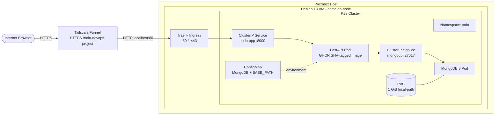
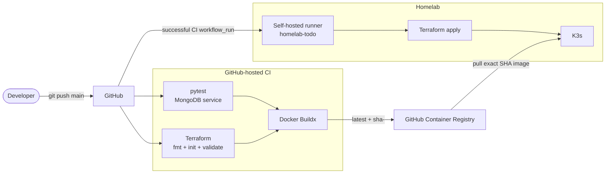
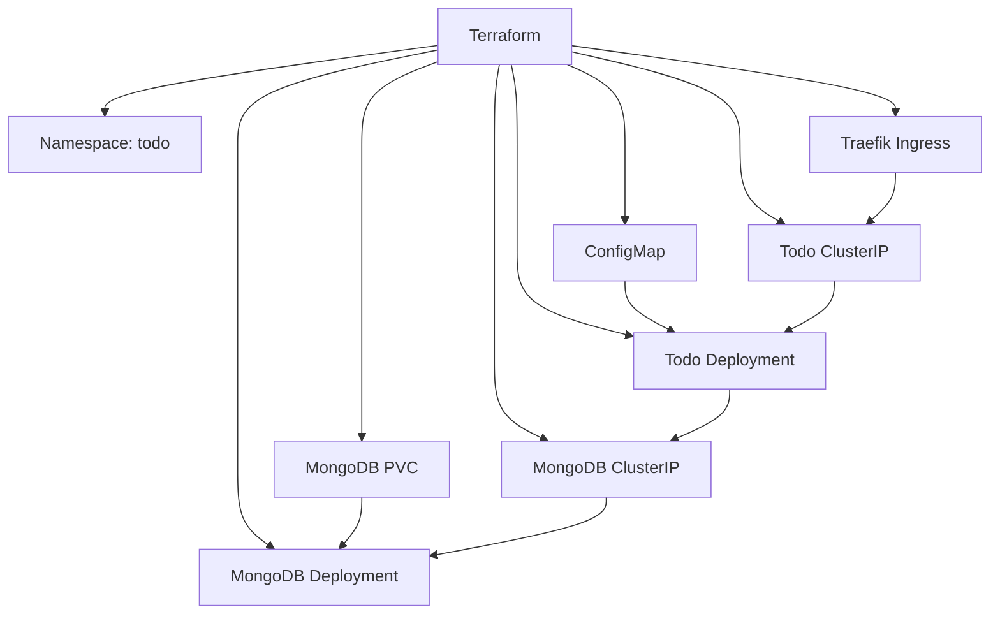

# TODO DevOps Project

A hands-on DevOps portfolio project built around a deliberately small FastAPI Todo application. The application itself is simple so the project can focus on the full delivery lifecycle: **development, automated testing, containerization, CI/CD, Infrastructure as Code, Kubernetes and homelab operations**.

The current version is deployed automatically to a **single-node K3s cluster running inside a Debian VM on Proxmox**. Public access is provided through **Tailscale Funnel → Traefik Ingress → Kubernetes Service** without exposing ports on the home router.

---

## Project Snapshot

The project currently demonstrates practical work with:

- Python 3.14, FastAPI and Jinja2
- asynchronous MongoDB access with PyMongo
- pytest, HTTPX and ASGI lifespan testing
- Docker and Docker Compose
- Kubernetes with K3s
- Kubernetes namespaces, Deployments, Services, ConfigMaps, PVCs and Ingress
- Traefik as the K3s ingress controller
- Tailscale Funnel for public HTTPS access
- GitHub Container Registry (GHCR)
- Terraform with the HashiCorp Kubernetes provider
- persistent Terraform state outside the GitHub Actions workspace
- GitHub Actions CI on GitHub-hosted runners
- GitHub Actions CD on a self-hosted homelab runner
- immutable application deployment using Git SHA image tags
- Docker Buildx and GitHub Actions cache
- non-root application containers
- `/health` and `/ready` application endpoints
- base-path aware routing for reverse-proxy deployment
- static CSS assets served by FastAPI

---

## Current Status

| Area | Status | Notes |
|---|---|---|
| FastAPI application | ✅ | Add, list and delete Todo items |
| MongoDB persistence | ✅ | Async PyMongo + persistent K3s volume |
| Automated tests | ✅ | pytest + HTTPX + MongoDB service in CI |
| Docker | ✅ | Non-root application image |
| Docker Compose | ✅ | Local FastAPI + MongoDB stack |
| Kubernetes / K3s | ✅ | Single-node homelab cluster |
| Terraform | ✅ | K3s resources managed through IaC |
| Persistent Terraform backend | ✅ | State stored outside runner workspace |
| GHCR | ✅ | `latest` and long Git SHA tags |
| CI pipeline | ✅ | tests + Terraform validation + image build |
| Automated K3s deployment | ✅ | Self-hosted GitHub Actions runner |
| Traefik Ingress | ✅ | Routes cluster traffic to the Todo service |
| Tailscale Funnel | ✅ | Public HTTPS access without router port forwarding |
| Base-path support | ✅ | Application mounted under `/todo-devops-project` |
| Static CSS | ✅ | FastAPI `StaticFiles` integration |
| Health endpoints | ✅ | `/health` and Mongo-backed `/ready` |
| Kubernetes health probes | ⏳ | Planned hardening |
| Resource limits / securityContext | ⏳ | Planned hardening |
| Kubernetes Secrets / MongoDB auth | ⏳ | Planned hardening |
| Additional Todo features | ⏳ | Next application milestone |

---

## Homelab Architecture



No inbound router port forwarding is required. Tailscale Funnel terminates public HTTPS and forwards traffic to the local Traefik listener. Traefik then routes traffic through the Kubernetes `ClusterIP` service to the currently active application Pod.

The application uses a configurable base path:

```text
/todo-devops-project
```

This allows generated form actions and static asset URLs to work correctly behind the Funnel path prefix while FastAPI continues to expose its internal routes as `/`, `/add`, `/delete` and `/static/...`.

---

## CI/CD Architecture



### CI

`.github/workflows/ci.yml` runs on pushes and pull requests targeting `main`.

The pipeline contains three responsibilities:

1. **Test**
   - Python 3.14
   - MongoDB 8 service container
   - dependency installation with pip cache
   - pytest execution

2. **Terraform check**
   - `terraform fmt -check -recursive`
   - `terraform init -backend=false -input=false`
   - `terraform validate`

3. **Build**
   - waits for both validation jobs
   - uses Docker Buildx
   - uses GitHub Actions layer cache
   - pushes images only for `push` events
   - publishes `latest` on the default branch
   - publishes a long Git SHA tag for traceable deployments

### CD

`.github/workflows/deploy.yml` is triggered after the `CI` workflow completes on `main`.

The deploy job runs only when:

- CI finished successfully
- the original event was a `push`
- the triggering actor is the repository owner

The job runs on the dedicated self-hosted runner labelled `todo-deploy`, checks out the exact commit that passed CI and deploys the matching GHCR image:

```text
ghcr.io/jakubsx01/todo_devops_project:sha-<full-commit-sha>
```

This creates a direct relationship between source code, CI result, container image and the version running in K3s.

---

## Self-Hosted Deployment Runner

The deployment runner runs on the homelab VM under a dedicated Unix account:

```text
github-runner
```

The account does not require normal interactive administration privileges. It has access to the K3s kubeconfig through the dedicated `k3s-admin` group and runs Terraform against the local cluster.

The repository is public, so the self-hosted runner is intentionally restricted to deployment jobs and isolated inside the homelab VM. Pull request CI continues to run on GitHub-hosted runners and does not deploy to the cluster.

---

## Terraform

Terraform manages the Kubernetes application stack in namespace `todo`.

Managed resources currently include:

- Kubernetes namespace
- application ConfigMap
- MongoDB PersistentVolumeClaim
- MongoDB Deployment
- MongoDB ClusterIP Service
- Todo application Deployment
- Todo application ClusterIP Service
- Traefik Ingress



### Variables

The Terraform configuration currently parameterizes:

- namespace
- application image
- application base path
- MongoDB image
- application replica count
- MongoDB replica count
- MongoDB storage size

### Terraform state

The deployment workflow uses a local backend whose state is stored outside the ephemeral GitHub Actions `_work` directory:

```text
/home/github-runner/terraform-state/todo/terraform.tfstate
```

The deployment workflow initializes Terraform with this persistent backend before every `apply`.

The MongoDB PVC uses K3s `local-path` storage. Because the default K3s StorageClass uses `WaitForFirstConsumer`, Terraform is configured not to block waiting for the PVC to become bound before the MongoDB Pod is created.

---

## Application

Current functionality:

- [x] display Todo items
- [x] add Todo items
- [x] delete Todo items
- [x] persist data in MongoDB
- [x] asynchronous database operations
- [x] Jinja2 server-side rendering
- [x] environment-based configuration
- [x] configurable reverse-proxy base path
- [x] static CSS files
- [x] `/health` endpoint
- [x] `/ready` endpoint that verifies MongoDB connectivity
- [ ] edit Todo items
- [ ] mark Todo items as completed
- [ ] additional simple Todo metadata / filtering
- [ ] stronger input validation
- [ ] improved error handling

A Todo document is currently stored approximately as:

```python
{
    "_id": ObjectId(...),
    "title": "Learn Kubernetes"
}
```

---

## Health Endpoints

Application liveness:

```http
GET /health
```

Expected response:

```json
{"status":"ok"}
```

Application readiness and MongoDB connectivity:

```http
GET /ready
```

A successful MongoDB ping returns HTTP `200`. A database connectivity error returns HTTP `503`.

Kubernetes liveness and readiness probes based on these endpoints are planned as part of the next hardening stage.

---

## Automated Testing

The test suite uses:

- `pytest`
- `pytest-asyncio`
- `httpx.AsyncClient`
- `ASGITransport`
- `asgi-lifespan`
- a dedicated MongoDB test database

Current test coverage includes:

- loading the Todo page
- adding a Todo item
- deleting a Todo item
- MongoDB-backed application behavior
- FastAPI lifespan handling
- reverse-proxy base-path HTML generation
- execution inside GitHub Actions

Run locally with:

```bash
python -m pytest -v
```

---

## Docker

The application image is based on:

```text
python:3.14-slim
```

The Dockerfile:

- installs only Python dependencies required by the project
- creates a dedicated application user with UID `10001`
- copies application files with the correct ownership
- runs Uvicorn as the non-root `appuser`

For local multi-container development:

```bash
docker compose up --build
```

---

## Kubernetes / K3s

Useful commands:

```bash
kubectl get nodes
kubectl get pods -n todo
kubectl get svc -n todo
kubectl get ingress -n todo
kubectl get pvc -n todo
kubectl get events -n todo --sort-by=.lastTimestamp
```

Expected application stack:

```text
namespace/todo
├── deployment/todo-app
├── service/todo-app
├── ingress/todo-app
├── configmap/todo-app-config
├── deployment/mongodb
├── service/mongodb
└── pvc/mongodb-pvc
```

### Proxmox CPU note

MongoDB 5.0+ requires AVX on x86_64. During the K3s migration the generic Proxmox VM CPU model did not expose AVX to Debian, causing MongoDB 8 to enter `CrashLoopBackOff`.

The homelab VM therefore uses the Proxmox CPU type:

```text
host
```

which exposes the host CPU instruction set, including AVX/AVX2, to the guest VM.

---

## Public Access with Tailscale Funnel

The application is designed to be exposed under:

```text
https://<homelab-node>.<tailnet>.ts.net/todo-devops-project/
```

The persistent Funnel configuration points to Traefik rather than directly to a Pod:

```bash
tailscale funnel \
  --bg \
  --set-path=/todo-devops-project \
  http://127.0.0.1:80
```

This is important because the public endpoint remains unchanged during Kubernetes rolling updates:

```text
Tailscale Funnel
      ↓
Traefik
      ↓
Kubernetes Service
      ↓
current Todo Pod
```

No `kubectl port-forward` is required for normal public access.

---

## Repository Structure

```text
Todo_DevOps_project/
├── .github/
│   └── workflows/
│       ├── ci.yml
│       └── deploy.yml
├── app/
│   ├── main.py
│   ├── database.py
│   ├── static/
│   │   ├── style.css
│   │   └── app.js
│   └── templates/
│       └── index.html
├── k8s/
├── terraform/
│   ├── main.tf
│   ├── provider.tf
│   ├── variables.tf
│   ├── outputs.tf
│   └── .terraform.lock.hcl
├── tests/
├── Dockerfile
├── docker-compose.yml
├── requirements.txt
└── README.md
```

---

## Local Development

Create a virtual environment and install dependencies:

```bash
python -m venv .venv
source .venv/bin/activate
pip install -r requirements.txt
```

Run the application:

```bash
python -m uvicorn app.main:app --reload
```

Run tests:

```bash
python -m pytest -v
```

Terraform validation:

```bash
terraform -chdir=terraform fmt -check -recursive
terraform -chdir=terraform init -backend=false
terraform -chdir=terraform validate
```

---

## Roadmap

The next stage is focused on **hardening the working delivery platform before adding more infrastructure**.

### Application and container hardening

- [ ] validate Todo input length and empty/invalid values
- [ ] improve application exception handling
- [ ] remove unnecessary error details from responses
- [ ] add or review HTTP security headers
- [ ] review container filesystem permissions
- [ ] evaluate read-only root filesystem compatibility

### Kubernetes hardening

- [ ] configure liveness probe using `/health`
- [ ] configure readiness probe using `/ready`
- [ ] add CPU and memory requests/limits
- [ ] add container `securityContext`
- [ ] disable privilege escalation
- [ ] drop unnecessary Linux capabilities
- [ ] evaluate `readOnlyRootFilesystem`
- [ ] add MongoDB authentication
- [ ] move credentials to Kubernetes Secrets

### Application features

- [ ] mark a Todo item as completed
- [ ] edit Todo items
- [ ] add simple filtering or status display
- [ ] improve styling and client-side behavior

### DevOps exercises

- [ ] test a complete rolling update with a visible application change
- [ ] perform and document a Kubernetes rollback
- [ ] add deployment smoke tests after Terraform apply
- [ ] improve Terraform outputs and remove obsolete NodePort-specific output
- [ ] document backup/restore strategy for MongoDB data

---

## Project Objective

The Todo application is intentionally small. Its purpose is to provide a real workload for building, operating and troubleshooting a complete DevOps delivery process rather than to become a feature-heavy application.

The project currently covers the full path from source code to a publicly reachable homelab deployment:

```text
git push
   ↓
GitHub Actions CI
   ↓
GHCR SHA-tagged image
   ↓
GitHub Actions CD
   ↓
self-hosted runner
   ↓
Terraform
   ↓
K3s
   ↓
Traefik
   ↓
Tailscale Funnel
   ↓
Internet
```

**Python · FastAPI · MongoDB · pytest · Docker · Docker Compose · Kubernetes · K3s · Proxmox · Traefik · Tailscale · GHCR · Terraform · GitHub Actions · Buildx · CI/CD**
