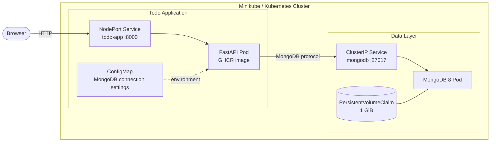
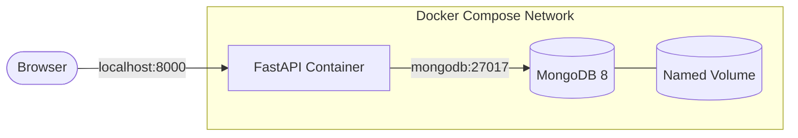
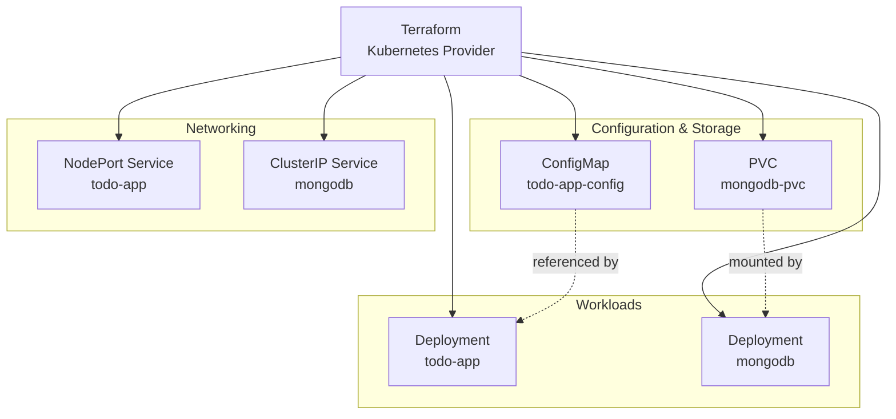
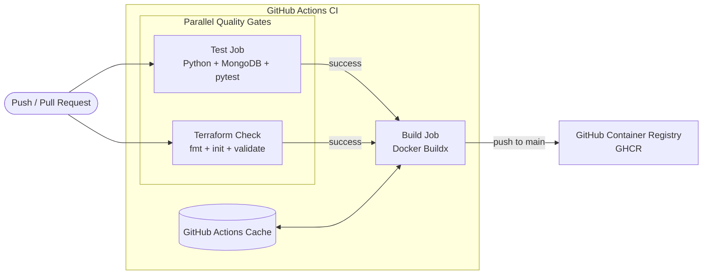
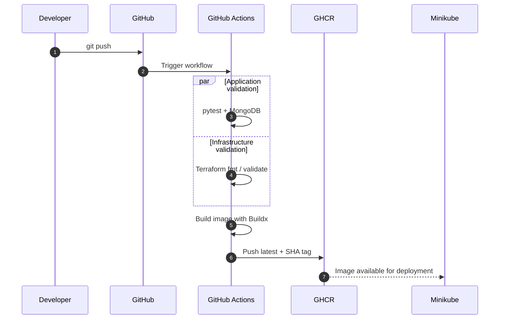

# TODO DevOps Project

A hands-on DevOps project built around a small FastAPI Todo application. The application is intentionally simple so the project can focus on the delivery lifecycle: **development, testing, containerization, orchestration, CI/CD and Infrastructure as Code**.

## Project Snapshot

The project currently demonstrates practical work with:

- Python 3.14, FastAPI and Jinja2
- asynchronous MongoDB access with PyMongo
- pytest, HTTPX and ASGI lifespan testing
- Docker and Docker Compose
- Kubernetes and Minikube
- ConfigMaps, Services, Deployments and PersistentVolumeClaims
- GitHub Container Registry (GHCR)
- Terraform with the Kubernetes provider
- GitHub Actions with parallel validation jobs, dependency caching and Docker Buildx
- immutable image identification with Git SHA tags
- CI concurrency control, timeouts and least-privilege job permissions

The current local platform is fully represented in Terraform and `terraform plan` reports no drift between the configuration, Terraform state and the running Kubernetes resources.

---

## Current Status

| Area | Status | Notes |
|---|---|---|
| FastAPI application | ✅ | Add, list and delete Todo items |
| MongoDB persistence | ✅ | Async PyMongo integration |
| Automated tests | ✅ | pytest + HTTPX + real MongoDB service in CI |
| Docker | ✅ | Custom application image |
| Docker Compose | ✅ | FastAPI + MongoDB local stack |
| Kubernetes / Minikube | ✅ | Application and database deployed locally |
| GHCR | ✅ | Images published from GitHub Actions |
| Kubernetes + GHCR | ✅ | Minikube pulls the published application image |
| Terraform | ✅ | Existing Kubernetes stack managed through IaC |
| Terraform CI validation | ✅ | `fmt`, `init` and `validate` |
| Optimized Docker CI | ✅ | Buildx, GHA cache, `latest` + SHA tags |
| Automated Kubernetes deployment | 🔄 | Next CI/CD milestone |
| Application hardening | ⏳ | Planned |
| Kubernetes Secrets / MongoDB auth | ⏳ | Planned |

---

## System Architecture



The FastAPI container is pulled directly from GHCR. MongoDB is reachable only through its internal `ClusterIP` service, while the application is exposed locally through `NodePort`.

---

## Application

Current functionality:

- [x] display Todo items
- [x] add Todo items
- [x] delete Todo items
- [x] persist data in MongoDB
- [x] asynchronous database operations
- [x] Jinja2 server-side rendering
- [x] environment-based configuration
- [x] MongoDB client lifecycle managed through FastAPI lifespan
- [ ] edit Todo items
- [ ] mark Todo items as completed
- [ ] improved CSS and client-side JavaScript
- [ ] stronger input validation and error handling

A Todo document is currently stored approximately as:

```python
{
    "_id": ObjectId(...),
    "title": "Learn Kubernetes"
}
```

---

## Automated Testing

The test suite uses:

- `pytest`
- `pytest-asyncio`
- `httpx.AsyncClient`
- `ASGITransport`
- `asgi-lifespan`
- a dedicated MongoDB test database

Current automated coverage includes:

- [x] loading the Todo page
- [x] adding a Todo item
- [x] deleting a Todo item
- [x] MongoDB-backed application behavior
- [x] FastAPI lifespan handling
- [x] execution inside GitHub Actions

The CI test job starts MongoDB 8 as a service container and connects to it through `localhost:27017`.

---

## Docker and Docker Compose

The application image is built from the repository `Dockerfile` and starts FastAPI through Uvicorn.

For local multi-container development, Docker Compose runs the application and MongoDB together:



Run the stack with:

```bash
docker compose up --build
```

---

## Kubernetes / Minikube

Implemented resources:

- [x] Todo application Deployment
- [x] Todo application NodePort Service
- [x] MongoDB Deployment
- [x] MongoDB ClusterIP Service
- [x] MongoDB PersistentVolumeClaim
- [x] application ConfigMap
- [x] GHCR application image
- [x] `imagePullPolicy: Always` for the current mutable `latest` deployment
- [x] disabled automatic service-account token mounting where not required
- [x] disabled unnecessary Kubernetes service-link environment injection
- [ ] Kubernetes Secrets
- [ ] MongoDB authentication
- [ ] readiness and liveness probes
- [ ] CPU / memory requests and limits
- [ ] rolling-update and rollback exercises

Useful commands:

```bash
kubectl get pods
kubectl get svc
kubectl get pvc
minikube service todo-app --url
```

---

## Terraform

Terraform now manages the Kubernetes resources running in Minikube through the HashiCorp Kubernetes provider.

Managed resources:



Current Terraform workflow:

```bash
cd terraform
terraform init
terraform fmt
terraform validate
terraform plan
terraform apply
```

The existing Kubernetes resources were imported into Terraform state and reconciled with their HCL definitions. The current configuration reaches a clean:

```text
No changes. Your infrastructure matches the configuration.
```

Next Terraform improvements:

- [ ] introduce `variables.tf`
- [ ] introduce `outputs.tf`
- [ ] parameterize namespace, images, replicas and storage
- [ ] verify full stack creation in an isolated namespace
- [ ] improve Terraform state/repository hygiene

---

## GitHub Actions CI

The workflow runs for pushes and pull requests targeting `main`.

The previous single-job pipeline has been refactored into separate responsibilities:



### Test job

- checks out the repository
- configures Python 3.14
- restores the pip dependency cache
- starts MongoDB 8 as a service container
- installs dependencies
- runs the pytest suite against `todo_app_test`

### Terraform check job

- runs independently from the application tests
- executes inside the `terraform/` directory
- runs `terraform fmt -check -recursive`
- runs `terraform init -backend=false -input=false`
- runs `terraform validate`

### Build job

The Docker build runs only after both validation jobs succeed using `needs`.

Implemented optimizations:

- Docker Buildx / BuildKit
- GitHub Actions layer cache (`cache-from` / `cache-to`)
- GHCR authentication only for push events
- image publication only for pushes to `main`
- `latest` tag for the default branch
- Git SHA tag for traceable builds
- job-level least-privilege permissions
- job timeouts
- workflow concurrency with stale-run cancellation

The current image flow is:



Automated deployment from GitHub Actions to the local Minikube cluster is the next CI/CD milestone.

---

## Repository Structure

```text
Todo_DevOps_project/
├── .github/
│   └── workflows/
│       └── ci.yml
├── app/
│   ├── main.py
│   ├── database.py
│   ├── models.py
│   ├── static/
│   └── templates/
├── k8s/
│   └── Kubernetes manifests
├── terraform/
│   ├── main.tf
│   ├── provider.tf
│   └── .terraform.lock.hcl
├── tests/
├── Dockerfile
├── docker-compose.yml
├── requirements.txt
└── README.md
```

---

## Local Development

Create a virtual environment and install dependencies:

```bash
python -m venv .venv
source .venv/bin/activate
pip install -r requirements.txt
```

Run the application:

```bash
python -m uvicorn app.main:app --reload
```

If MongoDB is running only inside Minikube:

```bash
kubectl port-forward svc/mongodb 27017:27017
```

Then open:

```text
http://127.0.0.1:8000
```

Run tests with:

```bash
python -m pytest -v
```

---

## Roadmap

The next project stages are intentionally focused on local DevOps engineering before moving to a public cloud:

1. finish Terraform parameterization and outputs
2. add automated deployment to Minikube using a self-hosted GitHub Actions runner
3. deploy immutable SHA-tagged application images
4. add a new Todo feature and use it to test the complete CI/CD path
5. improve the UI with CSS and JavaScript
6. harden the FastAPI container and Kubernetes workloads
7. add MongoDB authentication and Kubernetes Secrets
8. add health probes, resource limits and deployment/rollback exercises

Cloud deployment is intentionally deferred so the local CI/CD and IaC workflow can be completed first.

---

## Project Objective

The Todo application is deliberately small. The goal is to provide a real workload for building and troubleshooting a complete DevOps delivery process rather than to build a feature-heavy application.

**Python · FastAPI · MongoDB · pytest · Docker · Docker Compose · Kubernetes · Minikube · GHCR · Terraform · GitHub Actions · Buildx · CI/CD**
