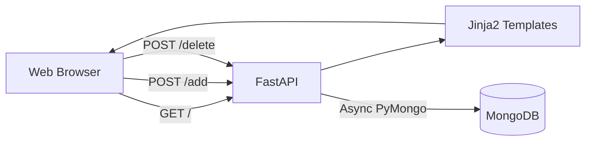
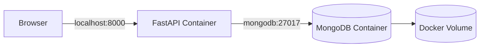
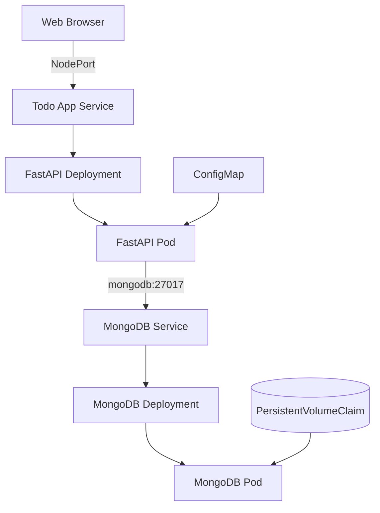
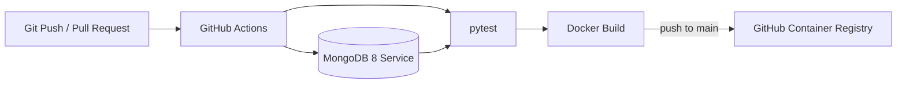
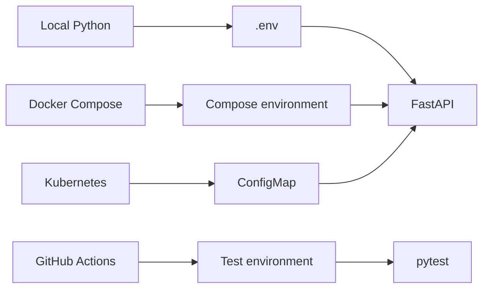

# TODO DevOps Project

A hands-on DevOps project built around a simple Python Todo web application.

The application is intentionally small so the main focus can stay on the full delivery lifecycle: **application development, persistent storage, containerization, orchestration, automated testing, CI/CD and Infrastructure as Code**.

## Recruiter Snapshot

This project currently demonstrates practical experience with:

- Python and FastAPI backend development
- asynchronous MongoDB integration with PyMongo
- FastAPI lifespan-based database resource management
- Jinja2 server-side rendering and HTML forms
- asynchronous application tests with pytest, HTTPX and `asgi-lifespan`
- Docker image creation with a custom Dockerfile
- multi-container environments with Docker Compose
- Docker networking, environment variables and persistent volumes
- Kubernetes Deployments, Services, ConfigMaps and PersistentVolumeClaims
- local Kubernetes deployment with Minikube
- GitHub Actions CI automation
- MongoDB service containers in CI
- automated Docker image builds
- container image publication to GitHub Container Registry (GHCR)
- Git-based incremental development

Next stages:

- use the GHCR image directly from Kubernetes
- Terraform Infrastructure as Code
- Kubernetes health checks and resource configuration
- deployment automation

---

## Current Status

| Technology | Purpose | Status |
|---|---|---|
| Python | Application backend | ✅ Implemented |
| FastAPI | Web framework | ✅ Implemented |
| Jinja2 | Server-side HTML rendering | ✅ Implemented |
| MongoDB | Persistent Todo storage | ✅ Implemented |
| PyMongo Async | Asynchronous database access | ✅ Implemented |
| pytest / HTTPX | Asynchronous application tests | ✅ Implemented |
| Docker | Application containerization | ✅ Implemented |
| Docker Compose | Local multi-container stack | ✅ Implemented |
| Kubernetes | Container orchestration | ✅ Implemented |
| Minikube | Local Kubernetes cluster | ✅ Implemented |
| PersistentVolumeClaim | MongoDB persistence in Kubernetes | ✅ Implemented |
| ConfigMap | Application configuration | ✅ Implemented |
| GitHub Actions | Automated CI pipeline | ✅ Implemented |
| GHCR | Container image registry | ✅ Implemented |
| Kubernetes + GHCR | Pull published image from registry | 🔄 Next stage |
| Terraform | Infrastructure as Code | ⏳ Planned |

---

## Application Features

The current application supports:

- [x] displaying Todo items
- [x] adding Todo items
- [x] deleting Todo items
- [x] persistent storage in MongoDB
- [x] asynchronous database operations
- [x] server-side HTML rendering with Jinja2
- [x] configuration through environment variables
- [x] MongoDB client lifecycle managed through FastAPI lifespan

A Todo document is stored in MongoDB approximately as:

```python
{
    "_id": ObjectId(...),
    "title": "Learn Kubernetes"
}
```

---

## Current Application Architecture



The MongoDB client is created during FastAPI application startup and closed during shutdown using the application lifespan lifecycle.

---

## Automated Testing

The project contains asynchronous application tests using:

- `pytest`
- `pytest-asyncio`
- `httpx.AsyncClient`
- `ASGITransport`
- `asgi-lifespan`
- a separate MongoDB test database

Current automated tests cover:

- [x] loading the Todo page
- [x] adding a Todo item
- [x] deleting a Todo item
- [x] MongoDB-backed application behavior
- [x] execution inside GitHub Actions

The tests use the real FastAPI lifespan lifecycle so MongoDB resources are created and closed within the correct async event loop.

---

## Docker

The application has been containerized using a custom `Dockerfile` based on a slim Python image.

Implemented Docker concepts:

- [x] Dockerfile creation
- [x] Python dependency installation inside the image
- [x] Uvicorn startup command
- [x] port exposure
- [x] Docker image build
- [x] running FastAPI inside a container
- [x] container networking
- [x] environment-based MongoDB configuration

### Docker Compose

A Docker Compose stack is used to run FastAPI and MongoDB together.



The Compose setup provides:

- FastAPI application container
- MongoDB 8 container
- automatic internal Docker networking
- persistent MongoDB volume
- application environment variables
- dependency ordering between services

The complete local stack can be started with:

```bash
docker compose up --build
```

---

## Kubernetes / Minikube

The Dockerized application has been deployed to a local Kubernetes cluster using Minikube.

Implemented Kubernetes resources and concepts:

- [x] FastAPI Deployment
- [x] FastAPI Service
- [x] MongoDB Deployment
- [x] MongoDB ClusterIP Service
- [x] MongoDB PersistentVolumeClaim
- [x] ConfigMap for application configuration
- [x] NodePort access to the application
- [x] local Docker image loading into Minikube
- [x] Pod and Service verification with `kubectl`
- [x] end-to-end communication between FastAPI and MongoDB inside the cluster
- [ ] replace the locally loaded application image with the image published to GHCR

### Current Kubernetes Architecture



---

## GitHub Actions CI/CD

A GitHub Actions workflow now runs automatically for pushes and pull requests targeting `main`.

Implemented pipeline stages:

- [x] checkout repository
- [x] configure Python 3.14
- [x] install project dependencies
- [x] start MongoDB 8 as a GitHub Actions service container
- [x] configure a separate test database
- [x] run the pytest test suite
- [x] build the Docker image
- [x] authenticate to GitHub Container Registry using `GITHUB_TOKEN`
- [x] publish the `latest` image to GHCR on pushes
- [x] avoid publishing images from pull request validation runs

Current pipeline:



The important difference between the current CI/CD state and the next stage is that **the image is already published to GHCR, but the Minikube Deployment still uses the locally loaded image**.

---

## Configuration Flow

The application reads MongoDB configuration from environment variables:

```text
MONGODB_URI
MONGODB_DB
```

The source of those values depends on the environment:



---

## Repository Structure

```text
Todo_DevOps_project/
│
├── app/
│   ├── database.py
│   ├── main.py
│   ├── models.py
│   ├── static/
│   └── templates/
│       └── index.html
│
├── tests/
│   ├── test_app.py
│   └── test_db.py
│
├── k8s/
│   └── Kubernetes manifests
│
├── terraform/
│
├── .github/
│   └── workflows/
│       └── ci.yml
│
├── Dockerfile
├── docker-compose.yml
├── requirements.txt
└── README.md
```

---

## Development Progress

### Application

- [x] FastAPI application
- [x] Jinja2 integration
- [x] Todo creation
- [x] Todo deletion
- [x] MongoDB ObjectId handling
- [x] persistent Todo storage
- [x] asynchronous MongoDB access
- [x] FastAPI lifespan database lifecycle
- [ ] Todo editing
- [ ] stronger input validation

### Database

- [x] MongoDB integration
- [x] database configuration through environment variables
- [x] asynchronous connection with PyMongo
- [x] persistent Docker storage
- [x] persistent Kubernetes storage with PVC

### Docker

- [x] Dockerfile
- [x] Docker image build
- [x] application container
- [x] MongoDB container
- [x] Docker networking
- [x] Docker Compose
- [x] persistent named volume
- [x] environment configuration

### Kubernetes

- [x] MongoDB PersistentVolumeClaim
- [x] MongoDB Deployment
- [x] MongoDB Service
- [x] FastAPI Deployment
- [x] FastAPI Service
- [x] ConfigMap
- [x] Minikube deployment
- [x] application exposed through NodePort
- [x] end-to-end application test in Kubernetes
- [ ] use GHCR image in the FastAPI Deployment
- [ ] Secrets
- [ ] readiness and liveness probes
- [ ] resource requests and limits
- [ ] scaling tests
- [ ] rolling update tests

### Testing

- [x] pytest test structure
- [x] asynchronous FastAPI endpoint tests
- [x] separate test environment configuration
- [x] MongoDB-backed integration testing
- [x] FastAPI lifespan handling in tests
- [x] tests integrated into GitHub Actions

### GitHub Actions / CI-CD

- [x] CI workflow
- [x] automatic Python dependency installation
- [x] MongoDB service container for tests
- [x] automated tests
- [x] Docker image build
- [x] GHCR authentication with `GITHUB_TOKEN`
- [x] container image tagging
- [x] push image to GHCR
- [ ] deploy published image to Kubernetes
- [ ] add deployment automation

### Terraform

Planned after connecting Kubernetes to the published GHCR image:

- [ ] configure Terraform Kubernetes provider
- [ ] define Kubernetes resources declaratively
- [ ] add variables and outputs
- [ ] use Terraform state
- [ ] run `terraform init`, `plan` and `apply`
- [ ] integrate Terraform formatting and validation with CI

---

## Local Development

Create and activate a virtual environment:

```bash
python -m venv .venv
source .venv/bin/activate
```

Install dependencies:

```bash
pip install -r requirements.txt
```

Run FastAPI locally:

```bash
python -m uvicorn app.main:app --reload
```

If MongoDB is running only inside Minikube, expose it temporarily to the local application with:

```bash
kubectl port-forward svc/mongodb 27017:27017
```

Then open:

```text
http://127.0.0.1:8000
```

---

## Running Tests

With a MongoDB instance available on the URI configured for the test environment:

```bash
python -m pytest -v
```

---

## Running with Docker Compose

```bash
docker compose up --build
```

Application:

```text
http://localhost:8000
```

---

## Running with Minikube

With the current local-image deployment:

```bash
kubectl get pods
kubectl get svc
kubectl get pvc
minikube service todo-app --url
```

The Kubernetes deployment currently provides persistent MongoDB storage and application configuration through a ConfigMap.

---

## Next Stage

The next milestone is to connect Kubernetes to the image already published by CI to **GitHub Container Registry**.

```text
Git Push
   ↓
GitHub Actions
   ↓
Tests
   ↓
Docker Build
   ↓
GHCR
   ↓
Kubernetes pulls published image
```

After that, the project will move to Terraform so the Kubernetes infrastructure can be represented and managed as Infrastructure as Code.

---

## Project Objective

The Todo application is deliberately simple. Its purpose is to provide a real workload for learning and demonstrating the complete DevOps lifecycle.

The project currently covers:

**Python · FastAPI · MongoDB · pytest · Docker · Docker Compose · Kubernetes · Minikube · ConfigMap · PersistentVolumeClaim · GitHub Actions · GHCR**

The next stages extend that lifecycle with:

**Kubernetes registry-based deployment · Terraform · CI/CD deployment automation**
